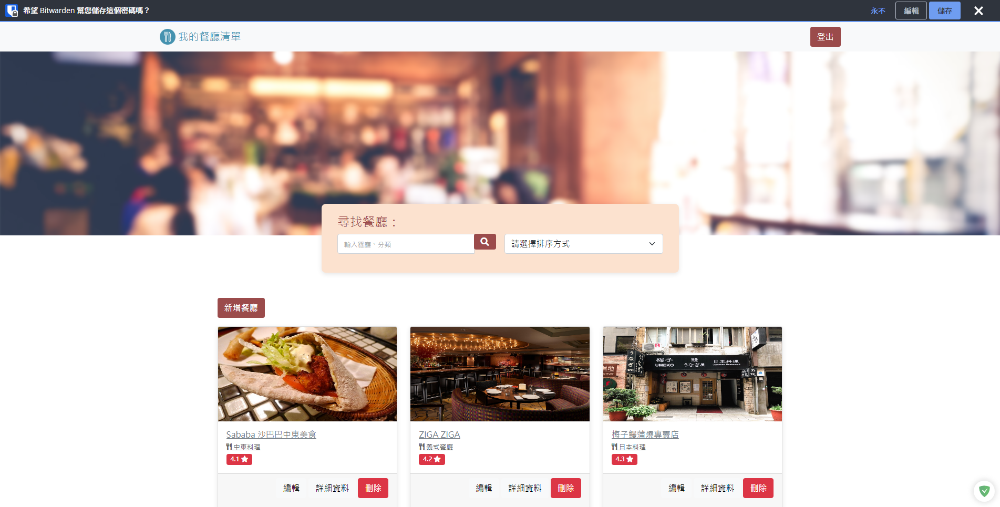

# 我的餐廳清單

## 簡介

本網站採用 Node.js 以及 Express 打造，目的為顯示使用者喜愛的餐廳清單，並包含下列兩項功能：

1. 另頁顯示個別餐廳的詳細資訊。
2. 透過搜尋功能（名稱或餐廳分類）尋找特定的餐廳。
3. 新增、刪除、修改餐廳資料。
4. 使用者登入機制 (包含本地及 Facebook 登入)，讓每名使用者可以管理自己專屬的餐廳清單。

## 畫面




## 環境建置

1.  Node.js version 19.3.0
2.  Express version 4.17.1
3.  Express-Handlebars version 3.0.0
4.  Mongoose version 5.9.7
5.  Dotenv version 16.3.1
6.  Method-override 3.0.0
7.  Passport 0.4.1

## 安裝流程

1.  打開終端機，cd 移動到預定放置本專案的資料夾，執行以下指令以複製本專案：

    ```
    git clone https://github.com/Taiwania/AC-restaurant-list-RESTful
    ```

2.  在該專案資料夾中，以終端機方式執行安裝 npm：

    ```
    npm install
    ```

3.  安裝完成後，請建立「.env」檔案，依照「.env.example」的格式設定連到您自己 MongoDB 的連結、Facebook 應用程式編號及密鑰。FACEBOOK_CALLBACK、PORT 請直接匯入 .env 不得更動，SESSION_SECRET 可以使用預設字串，也可以使用英數大小寫進行更動。

4.  執行以下指令，匯入本專案的種子資料到 MongoDB 資料庫：

    ```
    npm run seed
    ```

    看到以下訊息代表資料已經匯入 MongoDB：

    ```
    The data of restaurants is imported.
    ```

5.  最後執行以下指令啟動網站：

    ```
    npm run dev
    ```

    看到以下指令代表網站載入完成，可以使用瀏覽器打開 http://localhost:3000 即可進入網站。

    ```
    The website http://localhost:3000 is online.
    ```

    請使用 user1@example.com 或 user2@example.com 進行登入，密碼皆爲 12345678。